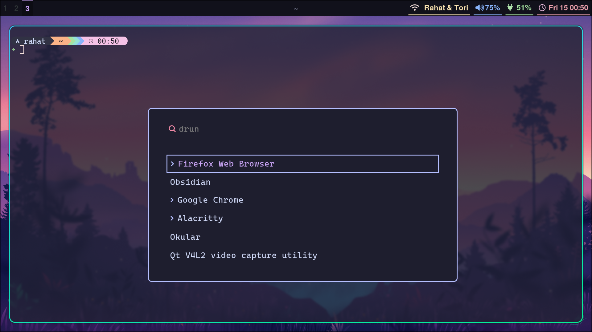

# My Arch Linux Build

A complete bare-metal Arch Linux installation with encrypted LVM, Hyprland window manager, and custom theming. This repository documents my journey from a fresh install to a fully configured desktop environment.

## 🖥️ System Specifications
- **Hardware**: Personal laptop (bare metal installation)
- **Storage**: NVMe SSD with full disk encryption (LUKS + LVM)
- **Desktop Environment**: Hyprland (Wayland compositor)
- **Theme**: Catppuccin-inspired with Typecraft dotfiles

## 📸 Screenshots
| Base Installation | Final Setup |
|-------------------|-------------|
|  |  |

## 🚀 Quick Overview

This build demonstrates:
- **Manual Arch installation** (no automated scripts)
- **Full disk encryption** with LUKS + LVM
- **Modern Wayland setup** with Hyprland
- **Professional theming** and customization
- **AUR package management** with paru
- **Comprehensive documentation** of the entire process

## 📋 Installation Guide

### Phase 1: Base System
1. [**Creating Install Medium**](docs/01-install-medium.md) - ISO download and USB flashing
2. [**Boot Process**](docs/02-booting.md) - BIOS setup and initial boot
3. [**Disk Partitioning**](docs/03-partitioning.md) - UEFI boot + LVM partition scheme
4. [**Encryption & LVM**](docs/04-encryption-lvm.md) - LUKS encryption with logical volumes
5. [**System Configuration**](docs/05-base-config.md) - fstab, timezone, and localization
6. [**Networking**](docs/06-networking.md) - systemd-networkd and wireless setup
7. [**Boot Configuration**](docs/07-mkinitcpio.md) - initramfs with encryption hooks
8. [**Bootloader**](docs/08-bootloader.md) - systemd-boot installation and configuration

### Phase 2: Desktop Environment
9. [**First Boot**](docs/09-first-boot.md) - Initial system verification
10. [**Hyprland Installation**](docs/10-hyprland.md) - Window manager and essential packages
11. [**AUR Helper Setup**](docs/11-aur-helper.md) - Installing paru for AUR packages
12. [**Desktop Components**](docs/12-finishing-touches.md) - Screenshots, notifications, lock screen

### Phase 3: Theming & Customization
13. [**Visual Theming**](docs/13-theming.md) - Catppuccin theme implementation with dotfiles

## 🛠️ Key Technologies Used

- **Encryption**: LUKS (dm-crypt) with passphrase authentication
- **Volume Management**: LVM2 for flexible storage management
- **Window Manager**: Hyprland (Wayland-based tiling compositor)
- **Audio**: PipeWire with PulseAudio compatibility
- **Status Bar**: Waybar with Font Awesome icons
- **Application Launcher**: Wofi
- **Terminal**: Kitty with Starship prompt
- **Package Management**: Pacman + Paru (AUR helper)
- **Dotfiles Management**: GNU Stow for symlink management

## 🔧 Configuration Files

All configuration files are organized in the [`configs/`](configs/) directory:

```
configs/
├── hypr/           # Hyprland configuration
├── waybar/         # Status bar configuration  
├── kitty/          # Terminal configuration
├── wofi/           # Application launcher
├── hyprlock/       # Lock screen configuration
└── starship/       # Shell prompt configuration
```

## 💡 Key Learning Points

### Security Considerations
- **Full disk encryption** protects data at rest
- **Separate boot partition** for UEFI compatibility
- **LVM flexibility** allows for future storage expansion

### System Architecture
- **Wayland over X11** for modern display protocol
- **systemd services** for network management
- **PipeWire** replaces older audio systems (ALSA/PulseAudio)

### Development Workflow
- **Manual installation** builds deep system understanding
- **AUR integration** provides access to community packages
- **Dotfiles management** ensures reproducible configurations

## 🎯 Why This Build?

This setup demonstrates several key technical skills:

1. **System Administration**: Manual Arch installation shows deep Linux knowledge
2. **Security Awareness**: Full disk encryption implementation
3. **Modern Technologies**: Wayland, PipeWire, systemd adoption  
4. **Customization Skills**: Theming and dotfiles management
5. **Documentation**: Clear, comprehensive setup guide
6. **Problem Solving**: Troubleshooting hardware compatibility (ACPI errors)

## 🔍 Hardware Compatibility Notes

- **ACPI Errors**: Resolved with `dmesg -D` during initial boot
- **Display Scaling**: Configured 1.5x scaling for optimal clarity
- **Graphics**: Mesa drivers for hardware acceleration
- **Audio**: PipeWire configuration for seamless audio routing

## 📚 Resources & Inspiration

- [Arch Linux Wiki](https://wiki.archlinux.org/) - Comprehensive documentation
- [Typecraft Dotfiles](https://github.com/typecraft-dev/dotfiles) - Configuration inspiration
- [Catppuccin Theme](https://github.com/catppuccin/catppuccin) - Color scheme

## 🤝 Usage

This repository serves as:
- **Personal reference** for future installations
- **Learning resource** for others attempting similar setups
- **Portfolio demonstration** of Linux system administration skills

Feel free to use any configurations or adapt the setup process for your own needs.

---

*Built on bare metal hardware - no VMs, no safety nets, just pure Arch Linux.*
