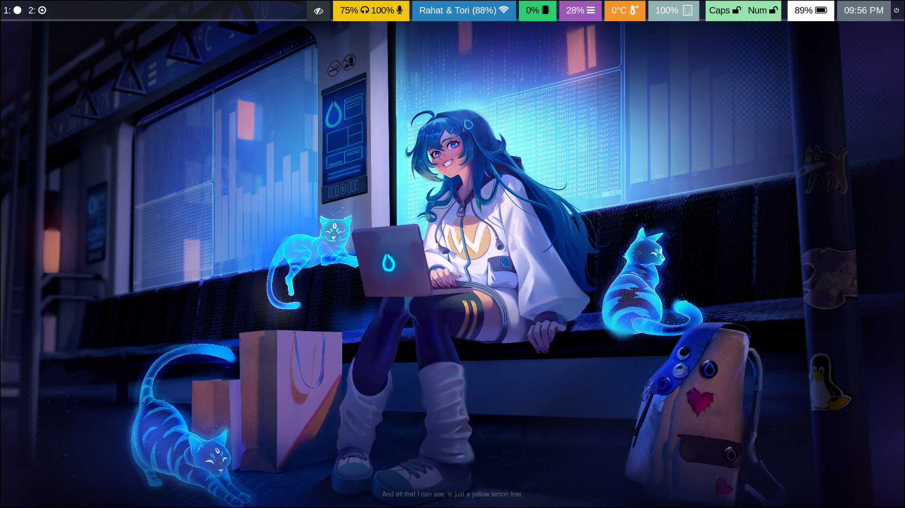
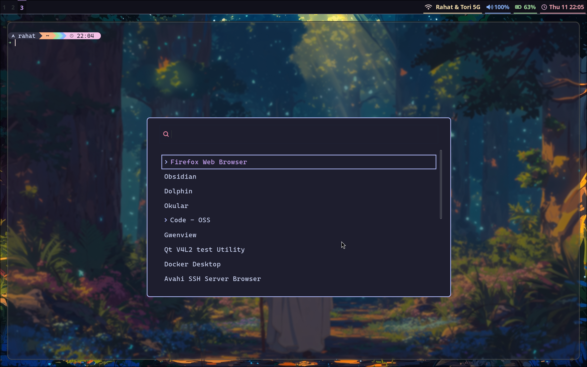

# My Arch Linux Build

A complete bare-metal Arch Linux installation with encrypted LVM, Hyprland window manager, and automated backups.

## 🖥️ System Specifications

- **Hardware**: Personal laptop (bare metal installation)
- **Storage**: NVMe SSD with full disk encryption (LUKS + LVM)
- **Desktop Environment**: Hyprland (Wayland compositor)
- **Theme**: Catppuccin-inspired with Typecraft dotfiles
- **Backup**: Automated nightly backups to QNAP NAS via Restic

## 📸 Screenshots

### Base Installation


### Final Desktop Setup
| Background & Waybar | Terminal & Wofi |
|---------------------|-----------------|
|  |  |

## 🚀 Quick Overview

- Manual Arch installation (no automated scripts)
- Full disk encryption with LUKS + LVM
- Hyprland window manager on Wayland
- Catppuccin theming
- Native Wayland app support with proper scaling
- AUR package management with paru
- Automated backup system with Restic to QNAP NAS

## 📋 Installation Guide

### Phase 1: Base System
1. [**Creating Install Medium**](docs/01-install-medium.md) - ISO download and USB flashing
2. [**Boot Process**](docs/02-booting.md) - BIOS setup and initial boot
3. [**Disk Partitioning**](docs/03-partitioning.md) - UEFI boot + LVM partition scheme
4. [**Encryption & LVM**](docs/04-encryption-lvm.md) - LUKS encryption with logical volumes
5. [**System Configuration**](docs/05-base-config.md) - fstab, timezone, and localization
6. [**Networking**](docs/06-networking.md) - systemd-networkd and wireless setup
7. [**Boot Configuration**](docs/07-mkinitcpio.md) - initramfs with encryption hooks
8. [**Bootloader**](docs/08-bootloader.md) - systemd-boot installation and configuration

### Phase 2: Desktop Environment
9. [**First Boot**](docs/09-first-boot.md) - Initial system verification
10. [**Hyprland Installation**](docs/10-hyprland.md) - Window manager and essential packages
11. [**AUR Helper Setup**](docs/11-aur-helper.md) - Installing paru for AUR packages
12. [**Desktop Components**](docs/12-finishing-touches.md) - Screenshots, notifications, lock screen

### Phase 3: Theming & Customization
13. [**Visual Theming**](docs/13-theming.md) - Catppuccin theme implementation with dotfiles

## 🛠️ Key Technologies Used

- **Encryption**: LUKS (dm-crypt) with passphrase authentication
- **Volume Management**: LVM2 for flexible storage management
- **Window Manager**: Hyprland (Wayland-based tiling compositor)
- **Display Protocol**: Native Wayland with Electron app optimization
- **Audio**: PipeWire with PulseAudio compatibility
- **Status Bar**: Waybar with Font Awesome icons
- **Application Launcher**: Wofi
- **Terminal**: Kitty with Starship prompt
- **Shell**: Bash with custom configurations
- **Editor**: Vim with personalized vimrc
- **Package Management**: Pacman + Paru (AUR helper)
- **Backup Solution**: Restic with SFTP to QNAP NAS

## 💡 Technical Notes

### Security
- Full disk encryption with LUKS
- Separate boot partition for UEFI
- LVM for flexible storage management
- Encrypted backups with SSH key authentication

### Display Server
- Native Wayland rendering eliminates XWayland scaling issues
- Electron apps configured for proper fractional scaling
- Environment variables tuned for high-DPI displays

### System Design
- systemd-networkd for network management
- PipeWire for audio
- systemd timers for scheduled tasks
- Manual installation process for understanding system architecture

## 🔍 Hardware Compatibility Notes

- **ACPI Errors**: Resolved with `dmesg -D` during initial boot
- **Display Scaling**: Configured 1.5x scaling for optimal clarity
- **Electron App Blur**: Solved with native Wayland environment variables
- **Graphics**: Mesa drivers for hardware acceleration
- **Audio**: PipeWire configuration for seamless audio routing

## 🐛 Common Issues Solved

### Blurry Electron Apps on Wayland

**Problem**: VS Code, Obsidian, and Discord appeared blurry with fractional scaling (150%)

**Solution**: Configured native Wayland rendering in Hyprland:
```bash
env = ELECTRON_ENABLE_WAYLAND,1
env = ELECTRON_OZONE_PLATFORM_HINT,wayland
```
This bypasses XWayland compatibility layer and enables proper fractional scaling support.

## 💾 Automated Backup System

Encrypted backup solution using **Restic** with automated nightly backups to QNAP NAS:

- **User backup** (9 PM): `/home/rahat` → 705 GB compressed to 3.3 GB (95% compression)
- **System backup** (9:30 PM): `/etc` and `/boot` → 262 MB
- **Retention**: 7 daily, 4 weekly, 12 monthly snapshots
- **Automation**: systemd timers with persistent catch-up
- **Security**: AES-256 encryption, SSH key authentication, separate user/root keys

**Quick commands:**
```bash
# Check status
systemctl --user list-timers | grep restic

# Manual backup
bash /backup/restic/restic-home-backup

# Restore file
restic restore latest --target /tmp/restore --include /path/to/file
```

**Scripts:** See [`scripts/`](scripts/) for implementation.

## 🔧 Configuration Files

### Dotfiles Management

Configs have migrated to a dedicated dotfiles system managed with [chezmoi](https://chezmoi.io) + [mise](https://mise.jdx.dev).

👉 **[github.com/AhsanRahat12/dotfiles](https://github.com/AhsanRahat12/dotfiles)**

Bootstrap on any fresh machine:
```bash
sh -c "$(curl -fsLS get.chezmoi.io)" -- -b $HOME/.local/bin init --apply git@github.com:AhsanRahat12/dotfiles.git
```

### Configuration Structure

All configurations managed via dotfiles repository:

```
dotfiles/
├── bash/           # Shell configuration and aliases
├── vim/            # Vim editor configuration
├── hypr/           # Hyprland configuration (with Wayland optimizations)
├── waybar/         # Status bar configuration  
├── kitty/          # Terminal configuration
├── wofi/           # Application launcher
├── hyprlock/       # Lock screen configuration
└── starship/       # Shell prompt configuration
```

**Notable configurations:**
- **Hyprland**: Native Wayland support for Electron apps, fractional scaling
- **Shell**: Custom bash aliases and productivity shortcuts
- **Vim**: Personalized vimrc with custom keybindings

## 📚 Resources & Inspiration

- [Arch Linux Wiki](https://wiki.archlinux.org/) - Comprehensive documentation
- [Typecraft Dotfiles](https://github.com/typecraft-dev/dotfiles) - Configuration inspiration
- [Catppuccin Theme](https://github.com/catppuccin/catppuccin) - Color scheme
- [Hyprland Documentation](https://wiki.hyprland.org/) - Wayland compositor configuration
- [Restic Documentation](https://restic.readthedocs.io/) - Backup solution

## 🤝 About This Repository

Personal documentation of an Arch Linux installation with Hyprland and automated backups.

---

Built on bare metal hardware - no VMs, no safety nets, just pure Arch Linux.
